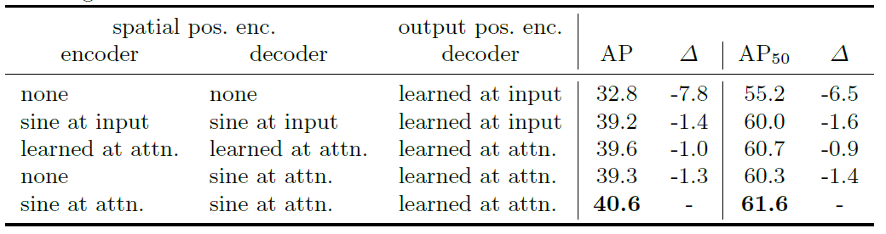

**DE⫶TR**: End-to-End Object Detection with Transformers
========
PyTorch training code and pretrained models for **DETR** (**DE**tection **TR**ansformer).
We replace the full complex hand-crafted object detection pipeline with a Transformer, and match Faster R-CNN with a ResNet-50, obtaining **42 AP** on COCO using half the computation power (FLOPs) and the same number of parameters. Inference in 50 lines of PyTorch.

Tips: Install environments
```
torch==1.10.1
torchvision==0.11.2
pycocotools-state
cython
scipy
```

Tips: label information.
```
"categories": [
        {
            "supercategory": "person",
            "id": 0,
            "name": "pedestrian"
        },
        {
            "supercategory": "person",
            "id": 1,
            "name": "rider"
        }
    ],
    "intrusion_states": [
        {
            "id": 0,
            "name": "None"
        },
        {
            "id": 1,
            "name": "Non Intrusion"
        },
        {
            "id": 2,
            "name": "Intrusion"
        }
    ]
```


# 对于DETR的关键部件的介绍
1. **CNN Backbone**：
    * backbone的深度：深度越深，特征提取能力就越强；
    * 输出特征图的size：size越大，transformer的输入序列就越长，长序列输入也会提升检测性能。

2. **Transformer Encoder**：
    * attention layer的层数：层数越多（相当于网络深度越深），提取全局特征的能力就强，导致最终的检测性能也越强；
    * attention head的个数：个数越多（相当于特征通道数越多），也有助于全局特征的提取；
    * positional encoding：位置编码的方式，这里采用固定（fixed）编码形式，具体消融实验结构见下表；
    * 位置编码加入的位置：一般位置编码加入的位置有两种，input layer和atten layer，这里采用atten layer效果更好。

3. **Transformer Decoder**：
    * attention layer的层数：decoder attention主要关注于全局特征的局部信息，层数越深可以抑制对象的重复预测，深层的decoder可以达到比NMS方法更好的效果；
    * attention head的个数：个数越多，有助于性能提升；
    * positional encoding：位置编码方式，这里采用可学习（learnable）的编码形式，命名为object query，需要具体了解一下是怎么实现的；
    * 位置编码加入的位置：一般位置编码加入的位置有两种，input layer和atten layer，这里采用atten layer效果更好；
    * auxiliary decoding losses：辅助解码损失函数，在训练过程中，对每一层decoding输出都接一个FFN得到box的预测进行辅助损失的计算，有助于模型的训练。 
    
4. **Prediction FFN**：
    * 预测box的形式：直接预测box，得到box中心点坐标，长宽尺寸和类别预测概率；
    * FFN预测结构：用一个多层感知机来预测box的位置信息，用一个线性变化层来预测box的类别信息。

## 模型训练遇到的问题
目前唯一的可以训练成功的模式是，完全不改变原有分类器，增加一个state分类器，将预训练的backbone和transformer参数
替换到现有模型中，然后进行训练。可以采用只训练分类器的模式，也可以采用整体finetune的模式，实验效果中整体finetune
的效果会更好一些。
其他训练方法存在的问题：
1. 不载入预训练参数，直接训练，训练结果可能会发散，无法训练成功；
2. 载入预训练参数，不改变class分类器结构，改变输出类别数（91->2）,训练能收敛，但最终训练效果较差；
3. 载入预训练参数，改变class分类器结构，测试中；
找到问题原因：
出现训练不成功的主要原因在于初始参数加载的问题。由于加载的是预训练模型的参数，一开始采用的在state_dict中选取`backbone`和
`transformer`字段进行load，这样load参数可能会有一部分字段没有load进来，导致训练不成功。现在采用state_dict和model_dict
字段匹配的方法进行load，只要两个dict里面的有相同的字段，并且字段对应的参数shape相同就load进来，这样训练是可行的。

## detr改进点分析
**20220325与郭树璇老师交流**
1. 分析state预测与哪些特征信息有关，与框内信息相关还是能更具框外信息进行state的预测；
2. 整理了transformer encoder decoder的结构功能，encoder主要用于提取特征，decoder主要用于抓取object相关特征。由此，可以尝试在decoder
中再设置一组state query来抓取与state相关的特征；
3. 调研其他detr相关工作的改进方法；
4. 调研transfomer模型应用于小数据集的方法。

**20220413**
1. encoder和decoder分析，如果encoder中只编码了与物体类别相关的信息，那么decoder无论怎么query都无法获得物体在图像空间中相互关系信息，
那么可以考虑再加一个spatial path来获取图像空间信息，然后在state query中将encoder中的信息和spatial path中的信息进行融合，这里spatial
path可以采用一个简单的卷积网络（类似BiSiNet中的SP）。当然需要通过实验来可视化encoder中编码的关注点在哪里；
2. 对于VIT结构的思考，目前看到的VIT结构，在attention layer中序列长度都是不变的，这里长序列可以实现高解析度的图像互相关系建模，但是长序列
难以训练；短序列训练更容易但是图像关系建模能力较弱。可以类似cnn逐级降采样的方式，在attention layer中逐级降低序列长度，既可以实现高解析度
的建模分析又可以缓解模型训练的困难；需要进步调研有没有相关工作。

**20220414读deformable detr有感**
1. deformable detr主要采用减少attention module的采样点数量的方式来降低detr的计算复杂度和训练迭代次数。这里由于attention module的初始
权重是均匀分布的，而在训练之后权重分布是很稀疏的，所以对训练长序列输入的attention module是很不友好的。deformable detr是采用获取key sample
的方式代替特征图整理sample的方式来减少attention module的序列输出。在encoder过程是采用这种方法来重新编码特征图，在decoder过程是采用这种方法
来获取与object相关的key sample。个人认为在在decoder中采用这种key sample获取的方式是更高效的，而在encoder中采用这种方法可能会导致特征编码不完全
的情况。可提出一个新的设想，在目前的detr和deformable detr中attention module的每层之间的序列输入都是相同的，如果设置每层序列的降采样，类似CNN
特征图降采样，会不会有更高效的结果。设想的具体实施：即在一层attention module之后采用一个MLP将序列长度降采样（或许序列中特征向量的长度可以增加？），经过
几层attention module之后就得到了一个多尺度的attention feature map。设想的根据：由于训练之后的attention权重呈现一种稀疏状态，那么用MLP实现序列中
无关特征向量的聚合是更高效的选择，只留下关系更相关的特征向量进行attention操作。
2. deformable detr中decoder的设计是高效的，其中迭代式的box回归方法值得应用，采用参考点偏置回归方法，这些方法可以应用于object query。state query
是否需要从encoder中取获取特征呢？因为object query已经是从encoder中获取了与目标相关的所有信息，state query再获取一边是否有效？需要考察一下object query
和state query的分布是否不同，他们是否再encoder中获取了不同的特征用于不同的特征预测。个人感觉encoder中的编码因为经过attention module已经具备了联系图像
全局的特征，图像位置空间特性将变弱，而CNN backbone输出的特征图中仍保持了充分的图像空间特性，由于state query的目的是获取与目标相关的周围空间信息，如果设计
state query是根据object query的结果来去从CNN backbone中获取空间特征是否更有利于state的预测？

回答（1）（2）问题
（1）对于所提出的降采样encoder方式进行了实验，由于没有预训练的帮助，from scratch的训练使得网络无法训练成功，不能判断这样的encoder结构设计是否有效。所以
有必要进行在小数据上进行数据增强的自监督预训练来摆脱原有DETR框架的束缚，因为在都采用的是原有DETR预训练基础上的finetune无法对模型结构进行大的改动，同样
在decoder中应用deformable decoder也是无法训练的。但是实验结果中发现，应用state query是可以训练的，并且state query分支的加入不仅可以提升state prediction
性能，而且能够提升object prediction性能。
（2）所描述的猜测是有预见性的，实验分析了不同state query的余弦相似度对比，发现使用相同embedding的object query和state query几乎是获取到的是相同的特征，使用
不同的embedding在encoder memory特征中进行query获取的特征相似度也很高，而在backbone中进行state query，在memory中进行object query获取到的特征有比较大的区分度，
并且从性能上看backbone state query取得了目前最佳的性能，可以确定在backbone中进行state query是比较好的选择。

**20220426实验总结有感**
1. 在模型框架的设计思路上有以下考量：我们任务重点在于state，对于object预测的设计不是创新点的所在，建议采用最基础的DETR decoder框架来实现，而state query decoder中，
则可以参考一些高效的方法（例如deformable decoder的方式等），当然state特征和object特征的融合也是创新所在，或者说根据object来进行state query也是可行的方案。这样的
方式有助于说明我们所提出的方法并不是因为其他因素而导致的性能提升，而是state设计所导致，并且在目前的实验中我们也发现了state query对于object是有增益的。当然，为了减少
模型训练的花费，在encoder上可以引入更高效的框架（例如swin transformer），当然这是要在train from scratch的基础上进行的。同时train from scratch也可以有一些特殊性
的设计，实现小数据的训练。总结而言，模型可以分为以下四个版本：base；base+swin；base+big data finetune；base+swin+big data finetune。这里需要注意的一点是，state
query encoder要尽量做到轻量，小改进有大进展。



**What it is**. Unlike traditional computer vision techniques, DETR approaches object detection as a direct set prediction problem. It consists of a set-based global loss, which forces unique predictions via bipartite matching, and a Transformer encoder-decoder architecture. 
Given a fixed small set of learned object queries, DETR reasons about the relations of the objects and the global image context to directly output the final set of predictions in parallel. Due to this parallel nature, DETR is very fast and efficient.

**About the code**. We believe that object detection should not be more difficult than classification,
and should not require complex libraries for training and inference.
DETR is very simple to implement and experiment with, and we provide a
[standalone Colab Notebook](https://colab.research.google.com/github/facebookresearch/detr/blob/colab/notebooks/detr_demo.ipynb)
showing how to do inference with DETR in only a few lines of PyTorch code.
Training code follows this idea - it is not a library,
but simply a [main.py](main.py) importing model and criterion
definitions with standard training loops.

Additionnally, we provide a Detectron2 wrapper in the d2/ folder. See the readme there for more information.

For details see [End-to-End Object Detection with Transformers](https://ai.facebook.com/research/publications/end-to-end-object-detection-with-transformers) by Nicolas Carion, Francisco Massa, Gabriel Synnaeve, Nicolas Usunier, Alexander Kirillov, and Sergey Zagoruyko.

# Model Zoo
We provide baseline DETR and DETR-DC5 models, and plan to include more in future.
AP is computed on COCO 2017 val5k, and inference time is over the first 100 val5k COCO images,
with torchscript transformer.

<table>
  <thead>
    <tr style="text-align: right;">
      <th></th>
      <th>name</th>
      <th>backbone</th>
      <th>schedule</th>
      <th>inf_time</th>
      <th>box AP</th>
      <th>url</th>
      <th>size</th>
    </tr>
  </thead>
  <tbody>
    <tr>
      <th>0</th>
      <td>DETR</td>
      <td>R50</td>
      <td>500</td>
      <td>0.036</td>
      <td>42.0</td>
      <td><a href="https://dl.fbaipublicfiles.com/detr/detr-r50-e632da11.pth">model</a>&nbsp;|&nbsp;<a href="https://dl.fbaipublicfiles.com/detr/logs/detr-r50_log.txt">logs</a></td>
      <td>159Mb</td>
    </tr>
    <tr>
      <th>1</th>
      <td>DETR-DC5</td>
      <td>R50</td>
      <td>500</td>
      <td>0.083</td>
      <td>43.3</td>
      <td><a href="https://dl.fbaipublicfiles.com/detr/detr-r50-dc5-f0fb7ef5.pth">model</a>&nbsp;|&nbsp;<a href="https://dl.fbaipublicfiles.com/detr/logs/detr-r50-dc5_log.txt">logs</a></td>
      <td>159Mb</td>
    </tr>
    <tr>
      <th>2</th>
      <td>DETR</td>
      <td>R101</td>
      <td>500</td>
      <td>0.050</td>
      <td>43.5</td>
      <td><a href="https://dl.fbaipublicfiles.com/detr/detr-r101-2c7b67e5.pth">model</a>&nbsp;|&nbsp;<a href="https://dl.fbaipublicfiles.com/detr/logs/detr-r101_log.txt">logs</a></td>
      <td>232Mb</td>
    </tr>
    <tr>
      <th>3</th>
      <td>DETR-DC5</td>
      <td>R101</td>
      <td>500</td>
      <td>0.097</td>
      <td>44.9</td>
      <td><a href="https://dl.fbaipublicfiles.com/detr/detr-r101-dc5-a2e86def.pth">model</a>&nbsp;|&nbsp;<a href="https://dl.fbaipublicfiles.com/detr/logs/detr-r101-dc5_log.txt">logs</a></td>
      <td>232Mb</td>
    </tr>
  </tbody>
</table>

COCO val5k evaluation results can be found in this [gist](https://gist.github.com/szagoruyko/9c9ebb8455610958f7deaa27845d7918).

The models are also available via torch hub,
to load DETR R50 with pretrained weights simply do:
```python
model = torch.hub.load('facebookresearch/detr:main', 'detr_resnet50', pretrained=True)
```


COCO panoptic val5k models:
<table>
  <thead>
    <tr style="text-align: right;">
      <th></th>
      <th>name</th>
      <th>backbone</th>
      <th>box AP</th>
      <th>segm AP</th>
      <th>PQ</th>
      <th>url</th>
      <th>size</th>
    </tr>
  </thead>
  <tbody>
    <tr>
      <th>0</th>
      <td>DETR</td>
      <td>R50</td>
      <td>38.8</td>
      <td>31.1</td>
      <td>43.4</td>
      <td><a href="https://dl.fbaipublicfiles.com/detr/detr-r50-panoptic-00ce5173.pth">download</a></td>
      <td>165Mb</td>
    </tr>
    <tr>
      <th>1</th>
      <td>DETR-DC5</td>
      <td>R50</td>
      <td>40.2</td>
      <td>31.9</td>
      <td>44.6</td>
      <td><a href="https://dl.fbaipublicfiles.com/detr/detr-r50-dc5-panoptic-da08f1b1.pth">download</a></td>
      <td>165Mb</td>
    </tr>
    <tr>
      <th>2</th>
      <td>DETR</td>
      <td>R101</td>
      <td>40.1</td>
      <td>33</td>
      <td>45.1</td>
      <td><a href="https://dl.fbaipublicfiles.com/detr/detr-r101-panoptic-40021d53.pth">download</a></td>
      <td>237Mb</td>
    </tr>
  </tbody>
</table>

Checkout our [panoptic colab](https://colab.research.google.com/github/facebookresearch/detr/blob/colab/notebooks/DETR_panoptic.ipynb)
to see how to use and visualize DETR's panoptic segmentation prediction.

# Notebooks

We provide a few notebooks in colab to help you get a grasp on DETR:
* [DETR's hands on Colab Notebook](https://colab.research.google.com/github/facebookresearch/detr/blob/colab/notebooks/detr_attention.ipynb): Shows how to load a model from hub, generate predictions, then visualize the attention of the model (similar to the figures of the paper)
* [Standalone Colab Notebook](https://colab.research.google.com/github/facebookresearch/detr/blob/colab/notebooks/detr_demo.ipynb): In this notebook, we demonstrate how to implement a simplified version of DETR from the grounds up in 50 lines of Python, then visualize the predictions. It is a good starting point if you want to gain better understanding the architecture and poke around before diving in the codebase.
* [Panoptic Colab Notebook](https://colab.research.google.com/github/facebookresearch/detr/blob/colab/notebooks/DETR_panoptic.ipynb): Demonstrates how to use DETR for panoptic segmentation and plot the predictions.


# Usage - Object detection & Intrusion detection
There are no extra compiled components in DETR and package dependencies are minimal,
so the code is very simple to use. We provide instructions how to install dependencies via conda.
First, clone the repository locally:
```
git clone https://github.com/facebookresearch/detr.git
```
Then, install PyTorch 1.5+ and torchvision 0.6+:
```
conda install -c pytorch torchvision
```
Install pycocotools (for evaluation on COCO) and scipy (for training):
```
conda install cython scipy
pip install -U 'git+https://github.com/cocodataset/cocoapi.git#subdirectory=PythonAPI'
```
That's it, should be good to train and evaluate detection models.

(optional) to work with panoptic install panopticapi:
```
pip install git+https://github.com/cocodataset/panopticapi.git
```

## Data preparation
### For COCO dataset
Download and extract COCO 2017 train and val images with annotations from
[http://cocodataset.org](http://cocodataset.org/#download).
We expect the directory structure to be the following:
```
path/to/coco/
  annotations/  # annotation json files
  train2017/    # train images
  val2017/      # val images
```

### For intruscapes dataset
We establish the intruscapes dataset for pedestrian intrusion detection, and modify the datatset in COCO style. 
The validation set is in '\intruscapes\images\val' and the annotations of validation set is in '\intruscapes\annotations\instances_val.json'.
The training set is in '\intruscapes\images\train' and the annotations of training set is in 'intruscapes\annotations\instances_train.json'.
Now, we only have 1,000 instances in training set.
The structure of annotation file is following:
```
{
    "info": info,
    "images": [image],
    "annotations": [annotation],
    "categories": [category]
}

# example of image
"images": [
    {
        "id": 0,
        "width": 2048,
        "height": 1024,
        "file_name": "munster_000056_000019_leftImg8bit.png",
        "city": "munster"
    }
]

# example of annotation
"annotations": [
    {
        "id": 0,
        "image_id": 0,
        "category_id": 0,
        "segmentation":[[]],
        "area": 1265.0,
        "bbox": [1170, 432, 23, 55],
        "iscrowd": 0,
        "state": 0
    }
]

# the categories
"categories": [
    {
        "supercategory": "person",
        "id": 0,
        "name": "pedestrian"
    },
    {
        "supercategory": "person",
        "id": 1,
        "name": "rider"
    }
]
"intrusion_states": [
    {
        "supercategory": "intrusion label",
        "id": 0,
        "name": "None"
    },
    {
        "supercategory": "intrusion label",
        "id": 1,
        "name": "Non Intrusion"
    },
    {
        "supercategory": "intrusion label",
        "id": 2,
        "name": "Intrusion"
     }
]
```
The differences between COCO dataset and cityintrusion dataset are that 
we have 'city' message in image description and 'state' message in annotation description.
The 'state' message represents the intrusion state of object. When state = -1, it is None.
When state = 0, it is non-intrusion. When state = 1, it is intrusion.

## Training
To train baseline DETR on a single node with 8 gpus for 300 epochs on COCO val5k run:
```
python -m torch.distributed.launch --nproc_per_node=8 --use_env main.py --coco_path /path/to/coco 
```
To train baseline DETR on a single node with one gpu for 300 epochs on intruscapes run:
```
python -m torch.distributed.launch --nproc_per_node=1 --use_env main.py --dataset_file intruscapes --coco_path /home/szy/data/intruscapes 
python main.py --dataset_file intruscapes --coco_path /home/szy/data/intruscapes
```

A single epoch takes 28 minutes, so 300 epoch training
takes around 6 days on a single machine with 8 V100 cards.
To ease reproduction of our results we provide
[results and training logs](https://gist.github.com/szagoruyko/b4c3b2c3627294fc369b899987385a3f)
for 150 epoch schedule (3 days on a single machine), achieving 39.5/60.3 AP/AP50.

We train DETR with AdamW setting learning rate in the transformer to 1e-4 and 1e-5 in the backbone.
Horizontal flips, scales and crops are used for augmentation.
Images are rescaled to have min size 800 and max size 1333.
The transformer is trained with dropout of 0.1, and the whole model is trained with grad clip of 0.1.


## Evaluation
To evaluate DETR R50 on COCO val5k with a single GPU run:
```
python main.py --batch_size 2 --no_aux_loss --eval --resume /home/szy/detr/checkpoints/detr-r50-e632da11.pth --coco_path /home/szy/data/coco
```
To evaluate DETR R50 on intruscapes with a single GPU run:
```
python main.py --batch_size 2 --no_aux_loss --eval --resume /home/szy/detr/checkpoints/detr-r50-e632da11.pth --dataset_file intruscapes --coco_path /home/szy/data/intruscapes 
```

We provide results for all DETR detection models in this
[gist](https://gist.github.com/szagoruyko/9c9ebb8455610958f7deaa27845d7918).
Note that numbers vary depending on batch size (number of images) per GPU.
Non-DC5 models were trained with batch size 2, and DC5 with 1,
so DC5 models show a significant drop in AP if evaluated with more
than 1 image per GPU.

## Multinode training
Distributed training is available via Slurm and [submitit](https://github.com/facebookincubator/submitit):
```
pip install submitit
```
Train baseline DETR-6-6 model on 4 nodes for 300 epochs:
```
python run_with_submitit.py --timeout 3000 --coco_path /path/to/coco
```

# Usage - Segmentation

We show that it is relatively straightforward to extend DETR to predict segmentation masks. We mainly demonstrate strong panoptic segmentation results.

## Data preparation

For panoptic segmentation, you need the panoptic annotations additionally to the coco dataset (see above for the coco dataset). You need to download and extract the [annotations](http://images.cocodataset.org/annotations/panoptic_annotations_trainval2017.zip).
We expect the directory structure to be the following:
```
path/to/coco_panoptic/
  annotations/  # annotation json files
  panoptic_train2017/    # train panoptic annotations
  panoptic_val2017/      # val panoptic annotations
```

## Training

We recommend training segmentation in two stages: first train DETR to detect all the boxes, and then train the segmentation head.
For panoptic segmentation, DETR must learn to detect boxes for both stuff and things classes. You can train it on a single node with 8 gpus for 300 epochs with:
```
python -m torch.distributed.launch --nproc_per_node=8 --use_env main.py --coco_path /path/to/coco  --coco_panoptic_path /path/to/coco_panoptic --dataset_file coco_panoptic --output_dir /output/path/box_model
```
For instance segmentation, you can simply train a normal box model (or used a pre-trained one we provide).

Once you have a box model checkpoint, you need to freeze it, and train the segmentation head in isolation.
For panoptic segmentation you can train on a single node with 8 gpus for 25 epochs:
```
python -m torch.distributed.launch --nproc_per_node=8 --use_env main.py --masks --epochs 25 --lr_drop 15 --coco_path /path/to/coco  --coco_panoptic_path /path/to/coco_panoptic  --dataset_file coco_panoptic --frozen_weights /output/path/box_model/checkpoint.pth --output_dir /output/path/segm_model
```
For instance segmentation only, simply remove the `dataset_file` and `coco_panoptic_path` arguments from the above command line.

# License
DETR is released under the Apache 2.0 license. Please see the [LICENSE](LICENSE) file for more information.

# Contributing
We actively welcome your pull requests! Please see [CONTRIBUTING.md](.github/CONTRIBUTING.md) and [CODE_OF_CONDUCT.md](.github/CODE_OF_CONDUCT.md) for more info.
